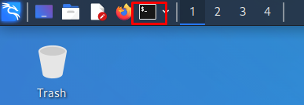
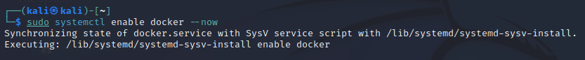
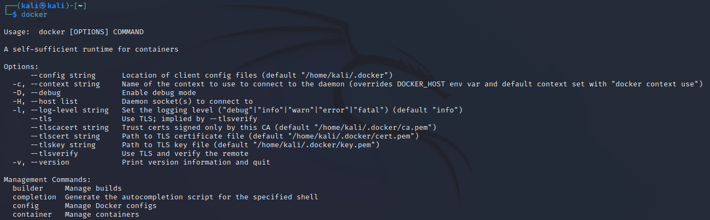

# :vertical_traffic_light: Pasos para instalar Docker en Kali Linux

1. Con la máquina virtual encendida, abra un terminal dando clic en el ícono de la barra de navegación o haciendo la combinacion de teclas `Ctrl + Alt + Letra t`.

    <div style="display:flex; justify-content:center; align-items:center;">
    
    </div>

2. Una vez abierto el terminal, ejecute los siguientes comandos para instalar y ejecutar docker:
    ```sh
    - sudo apt update
    - sudo apt install -y docker.io
    - sudo systemctl enable docker --now
    ```

    Sí todo queda bien, cuando ejecute el último comando de la lista verá lo siguiente:

    <div style="display:flex; justify-content:center; align-items:center;">
    
    </div>

    También puede ejecutar el comando `docker` para comprobar que ya está corriendo el servicio.

    <div style="display:flex; justify-content:center; align-items:center;">
    
    </div>

3. Para poder ejecutar docker en el grupo de usuarios personal o sin escribir `sudo`, escriba y ejecute en el terminal el comando `sudo usermod -aG docker $USER`.

4. Como la versión de Kali que estoy utilizando está basada en Debian Bullseye, adicioné el repositorio de Docker Community Edition con los siguientes comandos:
    ```sh
    - printf '%s\n' "deb https://download.docker.com/linux/debian bullseye stable" | sudo tee /etc/apt/sources.list.d/docker-ce.list

    - curl -fsSL https://download.docker.com/linux/debian/gpg | sudo gpg --dearmor -o /etc/apt/trusted.gpg.d/docker-ce-archive-keyring.gpg
    ```

5. Por último, ejecuté los siguientes comandos para instalar docker-ce:

    ```sh
    - sudo apt update
    - sudo apt install -y docker-ce docker-ce-cli containerd.io
    ```

## Referencias
- [Installing Docker on Kali Linux](https://www.kali.org/docs/containers/installing-docker-on-kali/)
- [Install Docker Engine on Debian](https://docs.docker.com/engine/install/debian/)

___

[:arrow_backward: Regresar al inicio](../README.md)