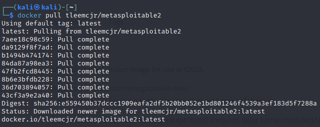
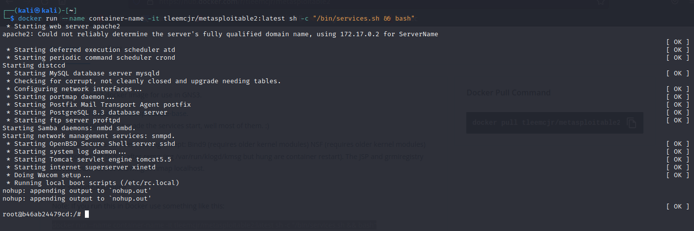
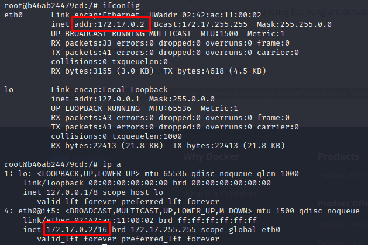
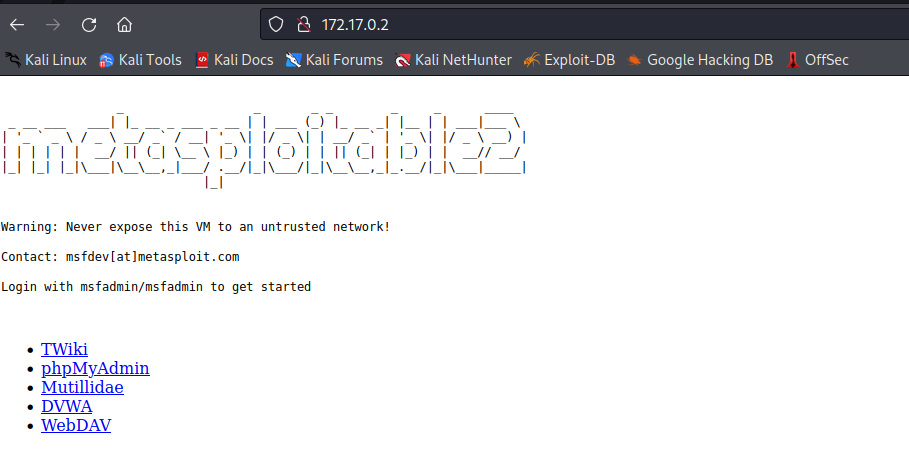

# :vertical_traffic_light: Pasos para instalar Metasploitable2 en Kali Linux

1. Tener Docker instalado, si no lo tienes [**aquí**](./Docker.md) puedes ver los pasos para instalarlo.

2. Abra un terminal y ejecute el comando `docker pull tleemcjr/metasploitable2` para descargar el contenedor de Metasploitable2. Si la descarga es correcta, verá un resultado similar al siguiente:

    

    
    

3. Cuando termine de descargar, ejecute el comando `docker run --name container-name -it tleemcjr/metasploitable2:latest sh -c "/bin/services.sh && bash"` para ejecutar el contenedor. Si la ejecución es correcta, entrará al terminal de Metasploitable2 como se ve a continuación:

    

    
    

4. Ejecute el comando `ifconfig` o `ip a` para obtener la dirección IP del contenedor, como se muestra en la siguiente imagen:

    

    
    

5. Por último, para confirmar que Metasploitable2 quedó bien configurado, copie la IP del contenedor y péguela en el navegador web de su preferencia en Kali. Si todo está funcionando bien, podrá ver la siguiente pantalla de inicio:

    

    
    

## Referencias
- [Metasploitable2 Container](https://hub.docker.com/r/tleemcjr/metasploitable2)
___

[:arrow_backward: Regresar al inicio](../README.md)